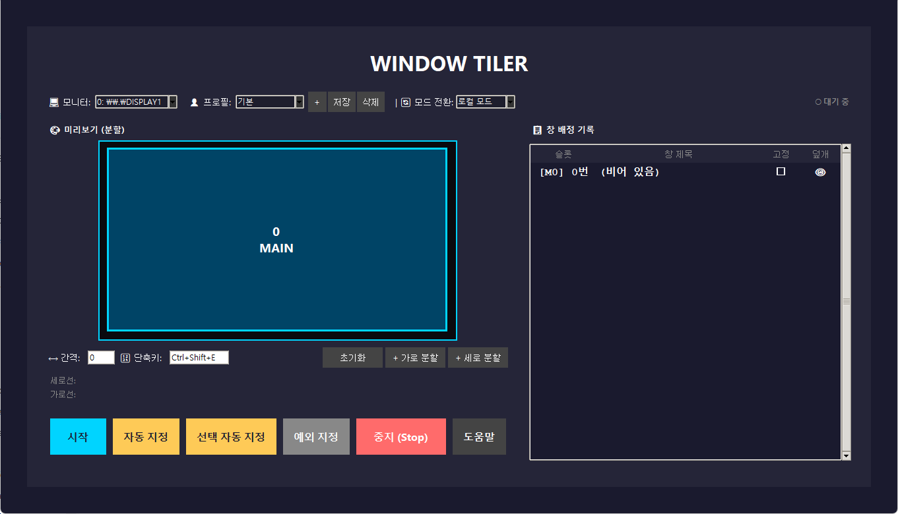

# 🪟 Window Tiler

<div align="center">


Windows용 멀티 모니터 창 타일링 도구

</div>

---

## 🖼️ 미리보기

<div align="center">
  
</div>

---

## 📖 프로젝트 소개

Window Tiler는 Windows 환경에서 여러 모니터를 지원하는 윈도우 타일링 도구입니다. 

다중 모니터를 사용하여 작업할 때 창들을 자동으로 정렬하고, 메인 슬롯과 사이드 슬롯 간의 창 위치를 쉽게 교환할 수 있습니다.

### 주요 기능

- 🚀 **멀티 모니터 지원**: 각 모니터별로 독립적인 타일링 프로필 적용
- 🔄 **로컬/글로벌 모드**: 모니터별 독립 운영 또는 전체 연동 모드
- 📦 **창 자동 배치**: 열린 창들을 슬롯에 자동으로 할당
- 💾 **프로필 저장/불러오기**: 커스텀 레이아웃을 프로필로 저장
- ⌨️ **단축키 지원**: 키보드로 빠른 타일링 제어
- 🔔 **트레이 실행**: 백그라운드에서 계속 운영

---

## 🛠️ 설치 방법

### 필수 요구사항

- Python 3.11 이상
- Windows 10/11

### 의존성 설치

```bash
pip install -r requirements.txt
```

### 실행 방법

```bash
python main.py
```

---

## 📋 사용 방법

### 기본 작동

1. 프로그램 실행 시 트레이 아이콘이 생성됩니다.
2. 트레이 아이콘을 우클릭하여 설정 창을 열 수 있습니다.
3. 단축키(`Ctrl+Shift+T` 기본값)를 눌러 타일링을 시작/중지합니다.

### 설정 창 사용

#### 상단 패널

- **모니터 선택**: 편집할 모니터 선택
- **프로필**: 레이아웃 프로필 선택/저장/삭제
- **모드 전환**: 로컬 모드 ↔ 글로벌 모드

#### 좌측 패널 (미리보기)

- **분할선 드래그**: 마우스로 분할 비율 조절
- **슬롯 클릭**: 메인 슬롯 지정
- **우클릭 메뉴**: 창 할당, 병합, 고정 등

#### 우측 패널 (창 배정 기록)

- 창 목록 확인
- 드래그 앤 드롭으로 창 위치 교환
- 고정/덮개 토글

### 창 교환 (Swap) 방법

1. **자동 교환**: 사이드 창을 클릭하면 메인 슬롯과 자동 교환
2. **투명 덮개 클릭**: 사이드 창 위의 덮개를 클릭하여 교환
3. **UI에서 교환**: 창 배정 기록에서 드래그하여 교환

---

## 📂 프로젝트 구조

```text
├── main.py                 # 앱 진입점 (Bootstrap)
├── requirements.txt        # 패키지 의존성
├── README.md               # 프로젝트 설명 문서
│
├── src/
│   ├── main.py             # 앱 라이프사이클 관리
│   ├── app_config.py       # 설정 관리자 래퍼
│   ├── tiling_engine.py    # 코어 타일링 엔진
│   ├── event_monitor.py    # 시스템 윈도우 포커스 감지
│   ├── hotkey_manager.py   # 전역 단축키 제어
│   ├── tray_manager.py     # 윈도우 작업표시줄 트레이 제어
│   ├── overlay_manager.py  # 윈도우 투명 보호 덮개 제어
│   ├── settings_gui.py     # 앱 설정 메인 GUI
│   │
│   ├── core/               # 🧠 핵심 비즈니스 로직 분리
│   │   ├── config_manager.py        # 파일 I/O 및 설정 객체
│   │   ├── global_window_manager.py # 다중 모니터 전역 스왑 로직
│   │   ├── layout_calculator.py     # 뷰-데이터 간 좌표 계산 분리
│   │   ├── slot_manager.py          # 창 배정(Slot) 상태 정보 캡슐화
│   │   └── slot_tree_controller.py  # GUI 트리뷰 이벤트 컨트롤러
│   │
│   ├── models/             # 📦 공통 데이터 모델 (Type Hinting)
│   │   └── common.py                # Rect, SlotState, MonitorInfo 등
│   │
│   ├── win_utils/          # 🪟 Windows OS API 연동 계층
│   │   ├── monitor_api.py           # 해상도, DPI 등 모니터 API
│   │   ├── window_api.py            # 윈도우 이동 및 프레임 보정
│   │   └── window_filter.py         # 유령 창 필터링 등 유효성 검사
│   │
│   └── gui/                # 🎨 하위 UI 위젯 및 컴포넌트
│       ├── preview_canvas.py
│       ├── slot_tree.py
│       ├── window_selector.py
│       ├── excluded_window_selector.py
│       ├── hotkey_entry.py
│       ├── theme.py
│       └── components/     # 패널 단위 분리
│           ├── profile_panel.py
│           ├── split_panel.py
│           └── control_panel.py
```

---

## 💻 개발 정보

### 🏗️ 소프트웨어 아키텍처 (Architecture)

최신 리팩토링을 통해 **역할 기반의 모듈화(Modularization)와 타입 힌팅(Type Hinting)**이 전면 적용되어 높은 응집도(Cohesion)와 낮은 결합도(Coupling)를 유지합니다.
- **`src/core/`**: UI와 종속성이 없는 순수 비즈니스 및 상태 로직 계층 (`SlotManager`, `LayoutCalculator` 등)
- **`src/win_utils/`**: OS 시스템 환경과 맞닿아 있는 외부 의존성(Windows API) 계층 분리
- **`src/models/`**: Python `dataclass` 기반의 명확한 상태 구조체 (`MonitorInfo`, `SlotState` 등)

### 사용 기술

| 기술 | 설명 |
|------|------|
| Python 3.11+ | 프로그래밍 언어 |
| Tkinter | GUI 프레임워크 |
| ctypes | Windows API 호출 |
| win32gui | 윈도우 핸들링 |

### 개발 환경 설정

```bash
# 가상환경 생성
python -m venv venv

# 활성화 (Windows)
venv\Scripts\activate

# 의존성 설치
pip install -r requirements.txt

# 실행
python main.py
```

---

## ⚙️ 설정 파일

설정 파일은 `%APPDATA%/WindowTiler/config.json`에 저장됩니다.

### 주요 설정 항목

| 항목 | 설명 | 기본값 |
|------|------|--------|
| `hotkey` | 타일링 단축키 | `Ctrl+Shift+T` |
| `gap` | 창 간격 (픽셀) | `0` |
| `swap_mode` | 로컬/글로벌 모드 | `local` |
| `monitor_index` | 현재 선택된 모니터 | `0` |

---

## 📄 라이선스

MIT License

---

## 🔗 관련 링크

- 이슈 리포트: GitHub Issues
- 문서: Wiki
